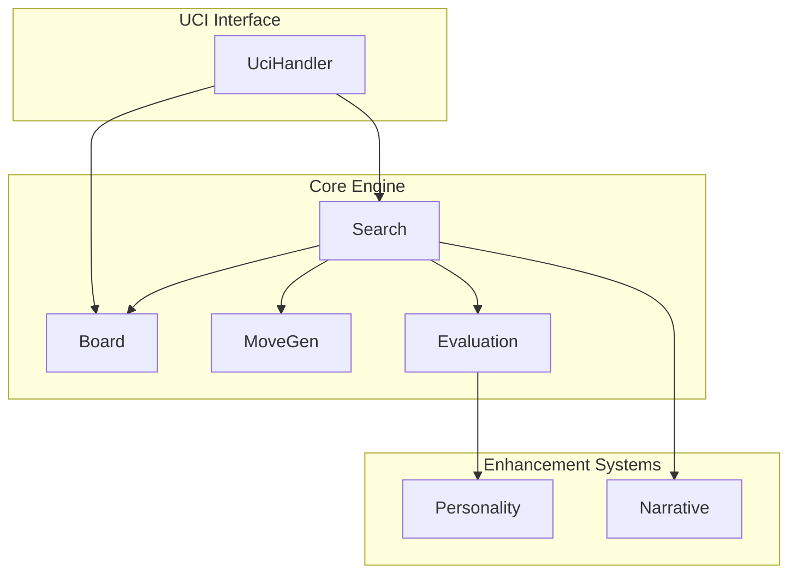
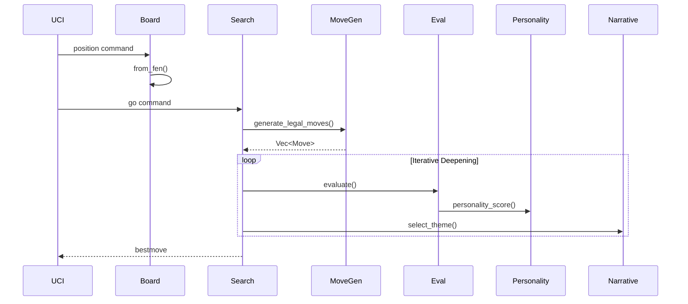

# Architecture

## System Overview

## Core Components

### Board Module (`src/board/`)
- **Board**: Core game state representation using bitboards
- **Move**: Move encoding (quiet, capture, promotion, castling, en passant)
- **ZobristKeys**: Position hashing for transposition table
- **FEN parsing**: Position import/export

### Move Generation (`src/movegen/`)
- Pseudo-legal move generation
- Legal move filtering (check detection)
- Perft testing utilities
- Special moves: castling, en passant, promotions

### Search (`src/search/`)
- **Alpha-beta search** with quiescence
- **Iterative deepening**
- **Transposition table** (TT)
- **History/Killer tables** for move ordering
- Time management

### Evaluation (`src/eval/`)
- Material balance
- Piece mobility
- Pawn structure
- King safety
- Piece-square tables

### Personality System (`src/personality/`)
Modular evaluation modifiers:
- `Romantic`: Active piece bonus
- `MomentumTracker`: Eval trend tracking
- `EntropyMaximizer`: Move count differences
- `ChaosTheory`: Simplification/chaos scoring
- `AsymmetryAddict`: Board asymmetry
- `ZugzwangHunter`: Endgame move counting

### Narrative System (`src/narrative/`)
Theme-based search guidance:
- `Storyteller`: Theme selection and scoring
- `Mirage`: Strategic purpose detection
- `TimeTraveler`: Depth extensions

## Data Flow

## Key Interfaces

| Interface | Purpose |
|-----------|---------|
| `Board::make_move()` | Apply move to board |
| `Board::generate_legal_moves()` | Get all legal moves |
| `Search::search()` | Main search entry point |
| `Evaluation::evaluate()` | Static position evaluation |
| `UciHandler::process_command()` | UCI command parser |
