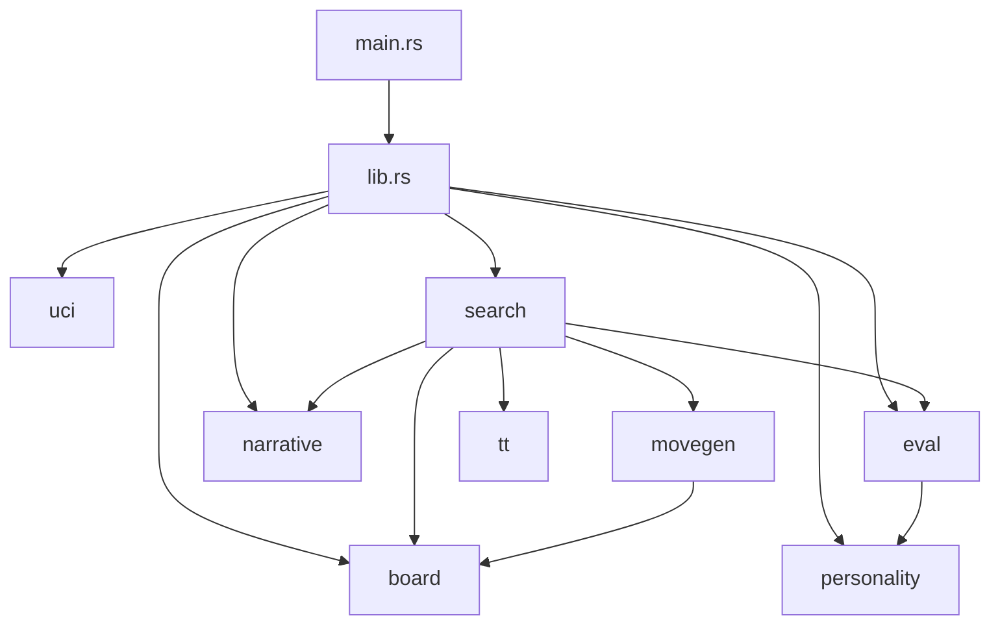

# Dependencies

## Rust Crates

Based on the codebase, this appears to be a relatively self-contained chess engine with minimal external dependencies.

### Core Dependencies (inferred from functionality)

- **Standard library**: Core Rust (`std`)
- **Testing**: `proptest` - Property-based testing
- **Linting**: Likely `clippy` for Rust linting

### Build System

- **Cargo**: Rust package manager and build tool

## Module Dependencies

## External Interfaces

### UCI Protocol
- Standard UCI commands: `position`, `go`, `setoption`, `ucinewgame`, `isready`, `quit`
- Custom extensions: `perft` command

### No Network Dependencies
- Fully offline chess engine
- No database connections
- No API calls
