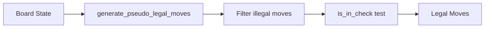
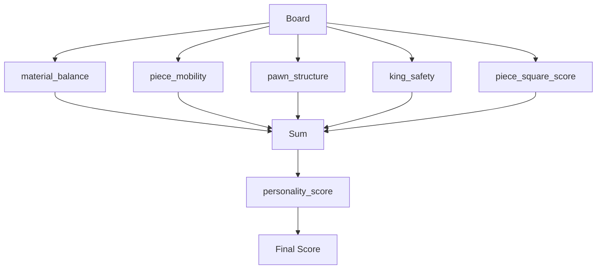
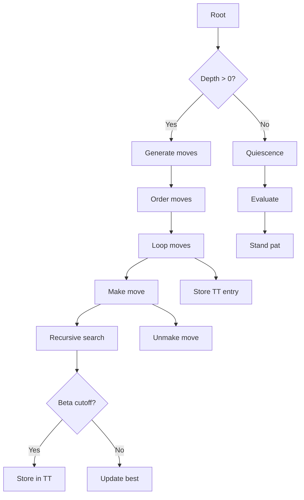
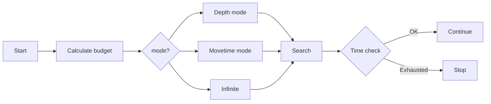

# Workflows

## UCI Command Processing

### Position Command
```mermaid
sequenceDiagram
    UCI→>Board: from_fen(fen)
    Note over Board: Parse piece placement
    Note over Board: Parse castling rights
    Note over Board: Parse en passant
    UCI→>Board: make_move() for each move
    Note over Board: Update state, store undo info
```

### Go Command
```mermaid
sequenceDiagram
    UCI→>Search: iterative_deepening(params)
    loop Depth Iteration
        Search→>MoveGen: generate_legal_moves()
        MoveGen-->>Search: moves
        Search→>Search: order_moves()
        loop Alpha-Beta
            Search→>Board: make_move()
            Search→>Eval: evaluate()
            Eval→>Personality: personality_score()
            Search→>Board: unmake_move()
        end
    end
    Search-->>UCI: bestmove
```

## Move Generation Pipeline



1. Generate pseudo-legal moves from piece positions
2. Filter captures that leave king in check
3. Filter quiet moves that leave king in check
4. Add special moves (castling, en passant, promotions)

## Evaluation Pipeline



## Search Flow



## Time Management



## FEN Round-Trip

1. Parse FEN string into board state
2. Generate FEN from board state
3. Compare for equality
4. Used in tests to verify board correctness
