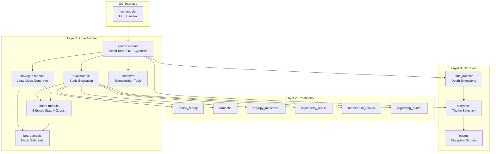
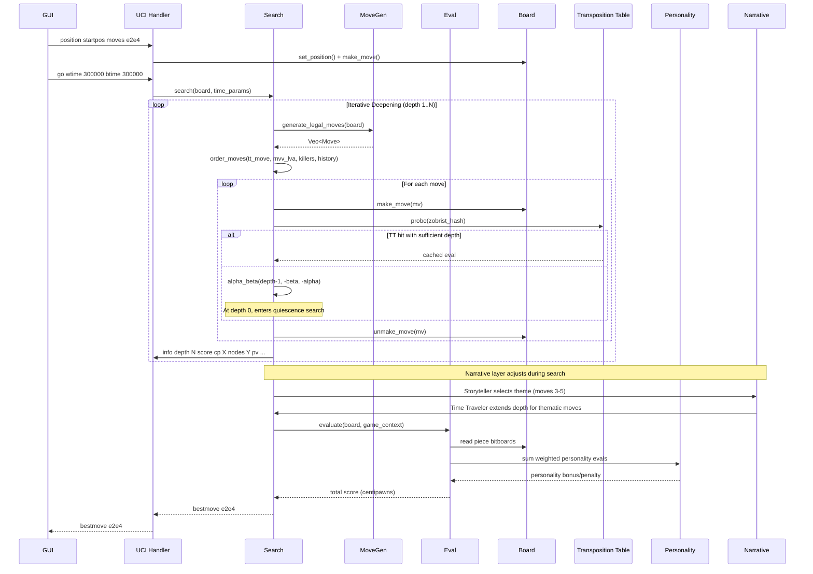

# Design Document: chess-engine-core

## Overview

This document describes the technical design for a personality-driven chess engine built in Rust (2021 edition). The engine is organized into three architectural layers:

1. **Core Engine (Layer 1):** High-performance chess fundamentals — bitboard board representation, magic bitboard attack generation, fully legal move generation, alpha-beta search with iterative deepening, transposition tables with Zobrist hashing, quiescence search, MVV-LVA move ordering, static evaluation with tapered piece-square tables, and UCI protocol support. Target baseline: ~2200 Elo.

2. **Personality Traits (Layer 2):** Six evaluation modifiers implementing a common `PersonalityEval` trait — Chaos Theory, Romantic, Entropy Maximizer, Asymmetry Addict, Momentum Tracker, and Zugzwang Hunter. Each contributes a weighted `i32` bonus/penalty to the base evaluation.

3. **Narrative Layer (Layer 3):** A meta-planning system above the search — Storyteller (theme selection), Time Traveler (depth extensions for thematic moves), and Mirage (deception bonuses for multi-purpose moves). These operate across game arcs, adjusting search behavior based on game phase.

The engine compiles to a single binary with no external crates for core logic. It communicates via the UCI protocol for GUI compatibility.

## Architecture

### System Architecture Diagram



### Data Flow



### Module Structure

```
src/
├── main.rs                    # Entry point, CLI arg parsing, UCI loop
├── board/
│   ├── mod.rs                 # Board struct, FEN parsing, make/unmake, Zobrist
│   └── magic.rs               # Magic bitboard tables, attack generation
├── movegen/
│   └── mod.rs                 # Legal move generation, perft
├── search/
│   ├── mod.rs                 # Alpha-beta, iterative deepening, quiescence
│   └── tt.rs                  # Transposition table
├── eval/
│   └── mod.rs                 # Static evaluation, tapered eval, PST
├── uci/
│   └── mod.rs                 # UCI protocol handler, time management
├── personality/
│   ├── mod.rs                 # PersonalityEval trait, GameContext, Game_Arc
│   ├── chaos_theory.rs
│   ├── romantic.rs
│   ├── entropy_maximizer.rs
│   ├── asymmetry_addict.rs
│   ├── momentum_tracker.rs
│   └── zugzwang_hunter.rs
└── narrative/
    ├── mod.rs                 # Theme enum, narrative coordinator
    ├── storyteller.rs
    ├── time_traveler.rs
    └── mirage.rs
```


## Components and Interfaces

### Layer 1: Core Engine

#### Board Module (`board/mod.rs`)

The central data structure. Owns all position state and provides make/unmake operations with incremental Zobrist updates.

```rust
/// Represents a single chess move
#[derive(Clone, Copy, PartialEq, Eq)]
pub struct Move {
    pub from: u8,          // 0-63 square index
    pub to: u8,            // 0-63 square index
    pub piece: Piece,      // moving piece type
    pub captured: Option<Piece>, // captured piece, if any
    pub promotion: Option<Piece>, // promotion target, if any
    pub flags: MoveFlags,  // castling, en passant, double push
}

#[derive(Clone, Copy, PartialEq, Eq)]
pub enum Piece {
    Pawn, Knight, Bishop, Rook, Queen, King,
}

#[derive(Clone, Copy, PartialEq, Eq)]
pub enum Color {
    White, Black,
}

bitflags! {  // implemented manually, no external crate
    pub struct MoveFlags: u8 {
        const QUIET        = 0b0000_0000;
        const DOUBLE_PUSH  = 0b0000_0001;
        const KING_CASTLE  = 0b0000_0010;
        const QUEEN_CASTLE = 0b0000_0100;
        const EN_PASSANT   = 0b0000_1000;
        const PROMOTION    = 0b0001_0000;
    }
}

#[derive(Clone, Copy, PartialEq, Eq)]
pub struct CastlingRights(u8);
// Bits: WK=0x1, WQ=0x2, BK=0x4, BQ=0x8

/// Core board state
pub struct Board {
    // 12 bitboards: [Color][Piece]
    pub pieces: [[u64; 6]; 2],
    // Aggregate occupancy
    pub occupancy: [u64; 2],  // per color
    pub all_occupancy: u64,
    
    pub side_to_move: Color,
    pub castling: CastlingRights,
    pub en_passant: Option<u8>,  // target square index
    pub halfmove_clock: u16,
    pub fullmove_number: u16,
    
    // Zobrist
    pub zobrist_hash: u64,
    
    // Undo stack for unmake
    history: Vec<UndoInfo>,
}

struct UndoInfo {
    captured: Option<Piece>,
    castling: CastlingRights,
    en_passant: Option<u8>,
    halfmove_clock: u16,
    zobrist_hash: u64,
}

impl Board {
    pub fn new() -> Self;                          // standard starting position
    pub fn from_fen(fen: &str) -> Result<Self, FenError>;
    pub fn to_fen(&self) -> String;
    pub fn make_move(&mut self, mv: Move);
    pub fn unmake_move(&mut self, mv: Move);
    pub fn is_in_check(&self, color: Color) -> bool;
    pub fn game_phase(&self) -> GamePhase;
}
```

#### Magic Bitboard Module (`board/magic.rs`)

Precomputed attack tables initialized once at startup. All lookups are O(1).

```rust
/// Initialized once via `init_magic_tables()`
static mut BISHOP_ATTACKS: [[u64; 512]; 64] = [[0; 512]; 64];
static mut ROOK_ATTACKS: [[u64; 4096]; 64] = [[0; 4096]; 64];
static KNIGHT_ATTACKS: [u64; 64] = [/* precomputed */];
static KING_ATTACKS: [u64; 64] = [/* precomputed */];
static PAWN_ATTACKS: [[u64; 64]; 2] = [/* precomputed per color */];

pub struct MagicEntry {
    pub mask: u64,
    pub magic: u64,
    pub shift: u8,
}

static BISHOP_MAGICS: [MagicEntry; 64] = [/* ... */];
static ROOK_MAGICS: [MagicEntry; 64] = [/* ... */];

pub fn init_magic_tables();
pub fn bishop_attacks(sq: u8, occupancy: u64) -> u64;
pub fn rook_attacks(sq: u8, occupancy: u64) -> u64;
pub fn queen_attacks(sq: u8, occupancy: u64) -> u64;  // bishop | rook
pub fn knight_attacks(sq: u8) -> u64;
pub fn king_attacks(sq: u8) -> u64;
pub fn pawn_attacks(sq: u8, color: Color) -> u64;
```

#### Move Generation Module (`movegen/mod.rs`)

Generates all legal moves. Also provides perft for correctness verification.

```rust
pub enum MoveGenResult {
    Moves(Vec<Move>),
    Checkmate,
    Stalemate,
}

pub fn generate_legal_moves(board: &Board) -> MoveGenResult;
pub fn generate_captures(board: &Board) -> Vec<Move>;  // for quiescence
pub fn generate_evasions(board: &Board) -> Vec<Move>;   // check evasions
pub fn perft(board: &mut Board, depth: u32) -> u64;
pub fn perft_divide(board: &mut Board, depth: u32) -> Vec<(Move, u64)>;
```

#### Search Module (`search/mod.rs`)

Alpha-beta with iterative deepening, quiescence search, and move ordering.

```rust
pub struct SearchParams {
    pub max_depth: Option<u32>,
    pub move_time: Option<u64>,     // ms
    pub wtime: Option<u64>,
    pub btime: Option<u64>,
    pub winc: Option<u64>,
    pub binc: Option<u64>,
    pub moves_to_go: Option<u32>,
    pub infinite: bool,
}

pub struct SearchInfo {
    pub depth: u32,
    pub score: i32,
    pub nodes: u64,
    pub pv: Vec<Move>,
    pub time_ms: u64,
    pub nps: u64,
}

pub struct SearchState {
    pub tt: TranspositionTable,
    pub killer_moves: [[Option<Move>; 2]; MAX_PLY],
    pub history_table: [[i32; 64]; 12],  // [piece_index][to_square]
    pub nodes_searched: u64,
    pub stop: AtomicBool,  // signal to abort search
    // Narrative state
    pub narrative_context: Option<NarrativeContext>,
}

impl SearchState {
    pub fn search(&mut self, board: &mut Board, params: SearchParams) -> Move;
    fn iterative_deepening(&mut self, board: &mut Board) -> Move;
    fn alpha_beta(&mut self, board: &mut Board, depth: i32, alpha: i32, beta: i32, ply: u32) -> i32;
    fn quiescence(&mut self, board: &mut Board, alpha: i32, beta: i32, ply: u32) -> i32;
    fn order_moves(&self, moves: &mut Vec<Move>, board: &Board, ply: u32, tt_move: Option<Move>);
}
```

#### Transposition Table (`search/tt.rs`)

```rust
#[derive(Clone, Copy, PartialEq, Eq)]
pub enum NodeType {
    Exact,
    LowerBound,  // beta cutoff
    UpperBound,  // failed low
}

#[derive(Clone, Copy)]
pub struct TTEntry {
    pub key: u64,           // full Zobrist hash for verification
    pub best_move: Option<Move>,
    pub score: i32,
    pub depth: i32,
    pub node_type: NodeType,
    pub age: u8,
}

pub struct TranspositionTable {
    entries: Vec<TTEntry>,
    size: usize,            // number of entries
    generation: u8,         // current search generation for aging
}

impl TranspositionTable {
    pub fn new(size_mb: usize) -> Self;
    pub fn probe(&self, hash: u64) -> Option<&TTEntry>;
    pub fn store(&mut self, hash: u64, entry: TTEntry);
    pub fn clear(&mut self);
    pub fn new_generation(&mut self);
    pub fn resize(&mut self, size_mb: usize);
}
```

#### Evaluation Module (`eval/mod.rs`)

```rust
// Piece values in centipawns
const PAWN_VALUE: i32 = 100;
const KNIGHT_VALUE: i32 = 320;
const BISHOP_VALUE: i32 = 330;
const ROOK_VALUE: i32 = 500;
const QUEEN_VALUE: i32 = 900;

// Piece-square tables: [piece][square], separate MG and EG
static PST_MG: [[i32; 64]; 6] = [/* ... */];
static PST_EG: [[i32; 64]; 6] = [/* ... */];

const MATE_SCORE: i32 = 30_000;

pub fn evaluate(
    board: &Board,
    game_ctx: &GameContext,
    personalities: &[Box<dyn PersonalityEval>],
) -> i32;

fn material_balance(board: &Board) -> i32;
fn piece_square_score(board: &Board, phase: i32) -> i32;  // tapered
fn king_safety(board: &Board) -> i32;
fn pawn_structure(board: &Board) -> i32;
fn piece_mobility(board: &Board) -> i32;
fn mate_score(ply: u32) -> i32;  // MATE_SCORE - ply (prefer shorter mates)
```

#### UCI Module (`uci/mod.rs`)

```rust
pub struct UciHandler {
    board: Board,
    search_state: SearchState,
    options: UciOptions,
    game_context: GameContext,
}

pub struct UciOptions {
    pub hash_size_mb: usize,    // default 64
    pub max_depth: u32,         // default 64
    // Per-personality weights (f32 exposed as UCI spin options scaled to integer)
    pub personality_weights: HashMap<String, f32>,
}

impl UciHandler {
    pub fn run(&mut self);  // main UCI loop reading stdin
    fn handle_uci(&self);
    fn handle_isready(&self);
    fn handle_position(&mut self, tokens: &[&str]);
    fn handle_go(&mut self, tokens: &[&str]);
    fn handle_stop(&mut self);
    fn handle_quit(&self);
    fn handle_ucinewgame(&mut self);
    fn handle_setoption(&mut self, tokens: &[&str]);
    fn handle_perft(&mut self, depth: u32);
}
```

### Layer 2: Personality System

#### PersonalityEval Trait and GameContext (`personality/mod.rs`)

```rust
#[derive(Clone, Copy, PartialEq, Eq)]
pub enum GamePhase {
    Opening,          // moves 1-10
    EarlyMiddlegame,  // moves 10-20
    LateMiddlegame,   // moves 20-30
    Endgame,          // moves 30+
}

pub struct GameContext {
    pub move_number: u16,
    pub phase: GamePhase,
    pub eval_history: [i32; 8],  // last 8 evaluations, circular buffer
    pub eval_history_len: u8,
    pub our_legal_moves: u32,
    pub their_legal_moves: u32,
}

pub trait PersonalityEval {
    fn evaluate(&self, board: &Board, ctx: &GameContext) -> i32;
    fn weight(&self) -> f32;
    fn set_weight(&mut self, w: f32);
    fn name(&self) -> &str;
}
```

#### Game Arc Weight Table (`personality/mod.rs`)

```rust
pub struct GameArc {
    // weights[phase][personality_index]
    pub weights: [[f32; NUM_PERSONALITIES]; 4],
}

impl GameArc {
    pub fn default() -> Self;  // default weight profiles per phase
    pub fn get_weight(&self, phase: GamePhase, personality_idx: usize) -> f32;
    pub fn set_weight(&mut self, phase: GamePhase, personality_idx: usize, w: f32);
}
```

Default weight profiles (higher = more active in that phase):

| Phase | Chaos | Romantic | Entropy | Asymmetry | Momentum | Zugzwang |
|-------|-------|----------|---------|-----------|----------|----------|
| Opening | 0.5 | 1.2 | 0.5 | 0.8 | 0.3 | 0.1 |
| Early MG | 1.2 | 0.8 | 1.2 | 0.8 | 0.5 | 0.3 |
| Late MG | 0.8 | 0.5 | 0.8 | 0.5 | 1.2 | 0.5 |
| Endgame | 0.3 | 0.3 | 0.5 | 0.3 | 1.0 | 1.5 |

### Layer 3: Narrative System

#### Theme and Narrative Coordinator (`narrative/mod.rs`)

```rust
#[derive(Clone, Copy, PartialEq, Eq)]
pub enum Theme {
    KingsideAttack,
    CentralDomination,
    QueensideExpansion,
    PieceSacrificePreparation,
}

pub struct NarrativeContext {
    pub active_theme: Option<Theme>,
    pub theme_selected_at_move: u16,
    pub depth_extensions_used: u32,
    pub max_depth_extensions: u32,  // configurable, default 8 per search
}

pub fn select_theme(board: &Board, move_number: u16) -> Option<Theme>;
pub fn theme_alignment_score(board: &Board, mv: &Move, theme: Theme) -> i32;
```

#### Storyteller (`narrative/storyteller.rs`)

```rust
pub struct Storyteller;

impl Storyteller {
    /// Selects a theme between moves 3-5 based on position features
    pub fn select_theme(board: &Board, move_number: u16) -> Option<Theme>;
    
    /// Returns positive bonus for thematic moves, negative for contradicting moves
    pub fn evaluate_move_alignment(board: &Board, mv: &Move, theme: Theme) -> i32;
}
```

Theme selection heuristics:
- **KingsideAttack**: Pieces aimed at kingside, opponent king castled kingside, open/semi-open files toward king
- **CentralDomination**: Strong central pawn presence, knights on central squares
- **QueensideExpansion**: Queenside pawn majority, open queenside files
- **PieceSacrificePreparation**: Material imbalance potential, exposed opponent king

#### Time Traveler (`narrative/time_traveler.rs`)

```rust
pub struct TimeTraveler {
    pub extension_plies: i32,  // default 1
}

impl TimeTraveler {
    /// Returns extra depth (in plies) if the move aligns with the active theme
    pub fn depth_extension(
        &self,
        board: &Board,
        mv: &Move,
        narrative_ctx: &mut NarrativeContext,
    ) -> i32;
}
```

#### Mirage (`narrative/mirage.rs`)

```rust
pub struct Mirage;

impl Mirage {
    /// Returns a deception bonus based on how many strategic purposes the move serves
    /// beyond the active theme
    pub fn deception_bonus(board: &Board, mv: &Move, theme: Theme) -> i32;
    
    /// Counts distinct strategic purposes a move serves
    fn count_strategic_purposes(board: &Board, mv: &Move) -> u32;
}
```

Strategic purposes considered: attacking opponent pieces, defending own pieces, controlling center, opening files, creating pawn structure advantages, improving piece activity, restricting opponent mobility.


## Data Models

### Core Data Structures

#### Zobrist Key Set

Generated once at initialization using a PRNG seeded with a fixed value for reproducibility:

```rust
pub struct ZobristKeys {
    pub piece_square: [[[u64; 64]; 6]; 2],  // [color][piece][square] = 768 keys
    pub side_to_move: u64,                   // 1 key
    pub castling: [u64; 4],                  // WK, WQ, BK, BQ = 4 keys
    pub en_passant: [u64; 8],               // per file = 8 keys
}
// Total: 781 pseudorandom 64-bit keys

lazy_static! {  // implemented manually, no external crate
    pub static ref ZOBRIST: ZobristKeys = ZobristKeys::init();
}
```

#### Move Representation

Moves are encoded as a compact struct (fits in 8 bytes for efficient copying):

| Field | Type | Description |
|-------|------|-------------|
| from | u8 | Source square (0-63) |
| to | u8 | Destination square (0-63) |
| piece | Piece | Moving piece type |
| captured | Option\<Piece\> | Captured piece (None if quiet) |
| promotion | Option\<Piece\> | Promotion piece (None if not promotion) |
| flags | MoveFlags | Special move flags |

#### Transposition Table Entry Layout

Each entry is 24 bytes. Table size in entries = `(size_mb * 1024 * 1024) / 24`.

| Field | Size | Description |
|-------|------|-------------|
| key | 8 bytes | Full Zobrist hash for collision detection |
| best_move | 4 bytes | Encoded best move (optional) |
| score | 4 bytes | Evaluation score |
| depth | 2 bytes | Search depth |
| node_type | 1 byte | Exact / LowerBound / UpperBound |
| age | 1 byte | Search generation for replacement |
| _padding | 4 bytes | Alignment |

Replacement policy: Replace if new entry has greater depth, or if existing entry is from an older generation (age differs from current).

#### Game Context

```rust
pub struct GameContext {
    pub move_number: u16,
    pub phase: GamePhase,
    pub eval_history: [i32; 8],
    pub eval_history_len: u8,
    pub our_legal_moves: u32,
    pub their_legal_moves: u32,
}

impl GameContext {
    pub fn push_eval(&mut self, eval: i32);
    pub fn momentum(&self) -> i32;  // linear regression slope over eval_history
    pub fn update_phase(&mut self);
}
```

Phase determination:
- `move_number <= 10` → `Opening`
- `10 < move_number <= 20` → `EarlyMiddlegame`
- `20 < move_number <= 30` → `LateMiddlegame`
- `move_number > 30` → `Endgame`

### Key Algorithms

#### Magic Bitboard Lookup

For a sliding piece on square `sq` with board occupancy `occ`:

```
relevant_occ = occ & magic_entry[sq].mask
index = ((relevant_occ.wrapping_mul(magic_entry[sq].magic)) >> magic_entry[sq].shift) as usize
attacks = ATTACK_TABLE[sq][index]
```

This yields O(1) attack generation for bishops, rooks, and queens.

#### Alpha-Beta with Iterative Deepening (Pseudocode)

```
fn iterative_deepening(board, params) -> Move:
    best_move = None
    for depth in 1..=max_depth:
        if time_expired(): break
        score = alpha_beta(board, depth, -INF, +INF, 0)
        best_move = pv[0]
        report_info(depth, score, nodes, pv, time)
    return best_move

fn alpha_beta(board, depth, alpha, beta, ply) -> i32:
    if time_expired(): return 0
    
    // TT probe
    if tt_entry = tt.probe(board.zobrist_hash):
        if tt_entry.depth >= depth:
            match tt_entry.node_type:
                Exact => return tt_entry.score
                LowerBound => alpha = max(alpha, tt_entry.score)
                UpperBound => beta = min(beta, tt_entry.score)
            if alpha >= beta: return tt_entry.score
    
    if depth <= 0: return quiescence(board, alpha, beta, ply)
    
    moves = generate_legal_moves(board)
    if moves.is_empty():
        if in_check: return -MATE_SCORE + ply  // checkmate
        else: return 0  // stalemate
    
    order_moves(moves, ply, tt_move)
    
    best_score = -INF
    best_move = None
    for mv in moves:
        // Narrative: Time Traveler depth extension
        extension = time_traveler.depth_extension(board, mv, narrative_ctx)
        
        board.make_move(mv)
        score = -alpha_beta(board, depth - 1 + extension, -beta, -alpha, ply + 1)
        board.unmake_move(mv)
        
        if score > best_score:
            best_score = score
            best_move = Some(mv)
        if score > alpha:
            alpha = score
        if alpha >= beta:
            // Update killer moves and history heuristic
            if !mv.is_capture():
                update_killers(ply, mv)
                update_history(mv, depth)
            break
    
    tt.store(board.zobrist_hash, TTEntry { best_move, score: best_score, depth, node_type, age })
    return best_score
```

#### Quiescence Search (Pseudocode)

```
fn quiescence(board, alpha, beta, ply) -> i32:
    stand_pat = evaluate(board, game_ctx, personalities)
    
    if stand_pat >= beta: return beta
    
    // Delta pruning threshold
    DELTA = 900  // queen value — biggest possible gain
    if stand_pat + DELTA < alpha: return alpha
    
    if stand_pat > alpha: alpha = stand_pat
    
    if in_check:
        moves = generate_evasions(board)
    else:
        moves = generate_captures(board) + queen_promotions
    
    order_moves_mvv_lva(moves)
    
    for mv in moves:
        // Delta pruning per-move
        if !in_check and stand_pat + piece_value(mv.captured) + 200 < alpha:
            continue
        
        board.make_move(mv)
        score = -quiescence(board, -beta, -alpha, ply + 1)
        board.unmake_move(mv)
        
        if score >= beta: return beta
        if score > alpha: alpha = score
    
    return alpha
```

#### Move Ordering Priority

1. **TT best move** (from transposition table probe)
2. **Captures** ordered by MVV-LVA score: `victim_value * 10 - attacker_value`
3. **Killer moves** (2 per ply, non-capture moves that caused beta cutoffs)
4. **History heuristic** (quiet moves scored by `history_table[piece][to_square]`)

#### Time Management

```
fn allocate_time(params) -> u64:
    if params.movetime.is_some(): return params.movetime
    if params.infinite: return u64::MAX
    
    our_time = if side == White { params.wtime } else { params.btime }
    our_inc = if side == White { params.winc } else { params.binc }
    
    moves_left = params.moves_to_go.unwrap_or(30)
    base_time = our_time / moves_left + our_inc.unwrap_or(0)
    
    // Safety: never use more than 50% of remaining time
    min(base_time, our_time / 2)
```

#### Tapered Evaluation

The evaluation interpolates between middlegame and endgame piece-square tables based on remaining material:

```
phase = total_phase_material / MAX_PHASE_MATERIAL  // 0.0 (endgame) to 1.0 (opening)
score = (mg_score * phase + eg_score * (1.0 - phase)) as i32
```

Phase material weights: pawn=0, knight=1, bishop=1, rook=2, queen=4. Max phase = 24 (all pieces on board).

### Design Decisions and Rationale

1. **No external crates for core logic**: Ensures full control over performance-critical code paths and meets the single-binary constraint. UCI parsing may use minimal string handling but no chess-specific crates.

2. **Bitboard representation over mailbox**: Bitboards enable SIMD-like parallelism through bitwise operations. Attack generation, pin detection, and mobility counting all benefit from population count and bit scan intrinsics.

3. **Magic bitboards over classical/rotated bitboards**: Magic bitboards provide O(1) sliding piece attack generation with a single multiply-shift-index operation, outperforming rotated bitboard approaches.

4. **Incremental Zobrist hashing**: XOR-based incremental updates during make/unmake are O(1) per move, avoiding full board rehashing.

5. **PersonalityEval as a trait object**: Using `dyn PersonalityEval` allows runtime composition and weight adjustment via UCI options. The performance cost of dynamic dispatch is negligible since evaluation is called at leaf nodes where the search overhead dominates.

6. **Narrative layer as meta-planner (not eval modifier)**: The narrative system operates above the search (adjusting depth, selecting themes) rather than just adding eval terms. This allows Time Traveler to extend search depth for thematic moves, which is fundamentally different from an eval bonus.

7. **Game phase by move number (not material)**: The personality/narrative system uses move number for game arc phasing, while the static evaluator uses material-based phase for tapered evaluation. This separation allows personality traits to activate on a predictable schedule independent of material exchanges.

8. **Fixed-size eval history (8 entries)**: The Momentum Tracker needs a sliding window of recent evaluations. Eight entries provide enough data for trend detection without excessive memory overhead.


## Correctness Properties

*A property is a characteristic or behavior that should hold true across all valid executions of a system — essentially, a formal statement about what the system should do. Properties serve as the bridge between human-readable specifications and machine-verifiable correctness guarantees.*

### Property 1: FEN Round Trip

*For any* valid chess position represented as a FEN string, parsing the FEN into a Board and then exporting back to FEN and parsing again shall produce an equivalent Board state (identical bitboards, side to move, castling rights, en passant, halfmove clock, and fullmove number).

**Validates: Requirements 1.4, 1.6, 1.7**

### Property 2: Invalid FEN Rejection

*For any* string that is not a valid FEN (wrong number of fields, invalid piece characters, illegal rank lengths, out-of-range values), parsing shall return an Err with a descriptive error message, and no Board shall be constructed.

**Validates: Requirements 1.5**

### Property 3: Sliding Piece Attack Correctness (Model-Based)

*For any* square (0–63) and *any* occupancy bitboard, the magic bitboard lookup for bishop attacks and rook attacks shall return the same result as a reference ray-casting implementation that iterates along diagonals/ranks/files and stops at the first blocker.

**Validates: Requirements 2.2, 2.3**

### Property 4: Queen Attack Composition

*For any* square and *any* occupancy bitboard, `queen_attacks(sq, occ)` shall equal `bishop_attacks(sq, occ) | rook_attacks(sq, occ)`.

**Validates: Requirements 2.4**

### Property 5: Non-Sliding Piece Attack Correctness

*For any* square (0–63), the precomputed knight, king, and pawn (both colors) attack bitboards shall match a reference implementation that computes attacks from the piece's movement rules.

**Validates: Requirements 2.5, 2.6**

### Property 6: Generated Moves Are Legal

*For any* valid Board position and *any* move returned by `generate_legal_moves`, making that move shall not leave the moving side's king in check. Additionally, when the side to move is in check, every generated move shall resolve the check.

**Validates: Requirements 3.1, 3.4, 3.5**

### Property 7: Terminal Position Detection

*For any* valid Board position where `generate_legal_moves` returns zero moves, the result shall be Checkmate if and only if the king is in check, and Stalemate if and only if the king is not in check.

**Validates: Requirements 3.6, 3.7**

### Property 8: Make/Unmake Round Trip

*For any* valid Board position and *any* legal move from that position, calling `make_move` followed by `unmake_move` shall restore the Board to a state identical to the original — including all 12 piece bitboards, occupancy bitboards, side to move, castling rights, en passant square, halfmove clock, fullmove number, and Zobrist hash.

**Validates: Requirements 4.3, 11.4**

### Property 9: Transposition Table Store/Probe Round Trip

*For any* TTEntry with a given Zobrist hash, storing the entry and then probing with the same hash shall return an entry with identical best_move, score, depth, and node_type fields (assuming no hash collision eviction).

**Validates: Requirements 4.4**

### Property 10: Transposition Table Replacement Policy

*For any* sequence of stores to the same TT bucket, the retained entry shall be the one with the greatest depth among entries of the current generation, or the newest-generation entry when depths are equal. Entries from older generations shall be replaced by entries from the current generation regardless of depth.

**Validates: Requirements 4.6**

### Property 11: Alpha-Beta Equivalence to Minimax

*For any* valid Board position and *any* search depth ≤ 4, the alpha-beta search shall return the same score as a plain negamax search (without pruning) to the same depth, confirming that pruning does not alter the result.

**Validates: Requirements 5.1**

### Property 12: MVV-LVA Capture Ordering

*For any* list of capture moves, after MVV-LVA ordering, each capture's score (`victim_value * 10 - attacker_value`) shall be greater than or equal to the next capture's score in the list.

**Validates: Requirements 6.4, 7.2**

### Property 13: Move Ordering Priority

*For any* set of moves containing a TT best move, captures, killer moves, and quiet moves with history scores, the ordering function shall place the TT move first, then captures by MVV-LVA, then killer moves, then quiet moves by history score.

**Validates: Requirements 7.1**

### Property 14: Killer and History Table Invariants

*For any* ply, the killer move table shall store at most two entries, both of which are non-capture moves. *For any* sequence of history table updates for a given piece-type and destination square, the accumulated score shall equal the sum of all individual depth-based increments.

**Validates: Requirements 7.3, 7.4**

### Property 15: Evaluation Symmetry

*For any* valid Board position, evaluating from White's perspective shall return the negation of evaluating the mirrored position from Black's perspective (where mirroring swaps colors and flips the board vertically), within the material and piece-square table components.

**Validates: Requirements 8.1**

### Property 16: Material Balance Correctness

*For any* Board position with known piece counts, the material balance component of the evaluation shall equal `(white_material - black_material)` where each piece type is valued at its standard centipawn value (P=100, N=320, B=330, R=500, Q=900).

**Validates: Requirements 8.2**

### Property 17: Tapered Evaluation Interpolation

*For any* Board position, the game phase value shall be in the range [0, 24] (based on remaining non-pawn material), and the tapered evaluation shall equal `(mg_score * phase + eg_score * (24 - phase)) / 24`.

**Validates: Requirements 8.4**

### Property 18: Pawn Structure Penalties

*For any* Board position containing doubled pawns on a file, the pawn structure evaluation shall include a penalty for those doubled pawns. *For any* position with an isolated pawn (no friendly pawns on adjacent files), the evaluation shall include an isolated pawn penalty.

**Validates: Requirements 8.6**

### Property 19: Mate Score Distance Encoding

*For any* checkmate position detected at ply N during search, the returned score shall equal `MATE_SCORE - N`, ensuring shorter mates are preferred over longer ones.

**Validates: Requirements 8.8**

### Property 20: UCI Position Command Correctness

*For any* valid FEN string and *any* sequence of legal moves in long algebraic notation, the `position` command handler shall produce a Board state equivalent to manually parsing the FEN and applying each move via `make_move`.

**Validates: Requirements 9.3**

### Property 21: Bestmove Output Format

*For any* completed search, the output shall be a string matching the pattern `bestmove [a-h][1-8][a-h][1-8][qrbn]?` (long algebraic notation with optional promotion suffix).

**Validates: Requirements 9.6**

### Property 22: Time Allocation Formula

*For any* time control parameters (wtime, btime, winc, binc, movestogo), the allocated move time shall equal `remaining_time / moves_left + increment` (where moves_left defaults to 30 if movestogo is absent), capped at 50% of remaining time. When movestogo is provided, moves_left shall equal movestogo plus a safety margin.

**Validates: Requirements 10.1, 10.2**

### Property 23: Weighted Personality Summation

*For any* set of PersonalityEval implementations with known weights and evaluate outputs, the total personality contribution to the evaluation shall equal the sum of `weight_i * evaluate_i` for all active personalities.

**Validates: Requirements 12.2**

### Property 24: Chaos Theory Monotonicity

*For any* two positions where position A has more total legal moves (both sides combined) than position B, the Chaos Theory bonus for A shall be greater than or equal to the bonus for B. Additionally, *for any* position where the total piece count is below the simplification threshold, the Chaos Theory module shall return a negative penalty component.

**Validates: Requirements 13.2, 13.3**

### Property 25: Romantic Activity Scoring

*For any* Board position and *any* piece, the Romantic module's contribution for that piece shall be proportional to the number of squares it attacks. *For any* piece with fewer than 3 available moves, the Romantic module shall include a negative penalty for that piece.

**Validates: Requirements 14.2, 14.3**

### Property 26: Entropy Maximizer Proportionality

*For any* Board position, the Entropy Maximizer bonus shall be proportional to `(our_legal_moves - their_legal_moves)`. When the engine has more legal moves, the bonus shall be positive; when fewer, negative.

**Validates: Requirements 15.2**

### Property 27: Asymmetry Addict Scoring

*For any* Board position, the Asymmetry Addict penalty shall be proportional to the degree of pawn file symmetry between sides (higher symmetry → larger penalty). *For any* position with material imbalances (e.g., bishop pair vs knight pair), the module shall return a positive bonus.

**Validates: Requirements 16.2, 16.3**

### Property 28: Momentum Tracker Trend Alignment

*For any* GameContext with an eval history of at least 2 entries, the Momentum Tracker output sign shall match the trend direction: positive output for improving trends (positive slope), negative output for worsening trends (negative slope), and near-zero for flat trends.

**Validates: Requirements 17.2, 17.3, 17.4**

### Property 29: Zugzwang Hunter Inverse Proportionality

*For any* two positions where position A gives the opponent fewer legal moves than position B, the Zugzwang Hunter bonus for A shall be greater than or equal to the bonus for B. *For any* position in the Endgame phase, the effective weight shall be greater than the weight in non-Endgame phases.

**Validates: Requirements 18.2, 18.3**

### Property 30: Storyteller Theme Selection Timing

*For any* Board position at move number 3, 4, or 5 where no theme has been selected yet, the Storyteller shall return `Some(Theme)`. *For any* position at move 1 or 2, the Storyteller shall return `None`.

**Validates: Requirements 19.1**

### Property 31: Theme Alignment Scoring

*For any* move and *any* active Theme, the Storyteller's alignment score shall be positive for moves that advance the theme and negative for moves that contradict it. The sign of the alignment score shall be consistent with the move's relationship to the theme's strategic goals.

**Validates: Requirements 19.2, 19.3**

### Property 32: Time Traveler Depth Extension

*For any* move aligned with the active Theme, the Time Traveler shall return a positive depth extension (default 1 ply). *For any* non-aligned move, the extension shall be 0. *For any* search, the cumulative depth extensions shall not exceed `max_depth_extensions`.

**Validates: Requirements 20.1, 20.2**

### Property 33: Mirage Deception Bonus

*For any* move that serves multiple strategic purposes (including advancing the active Theme), the Mirage bonus shall be positive and proportional to the number of additional strategic purposes beyond the theme. *For any* move serving only one purpose, the bonus shall be zero or minimal.

**Validates: Requirements 21.1, 21.2**

### Property 34: Game Arc Phase Weight Profiles

*For any* GamePhase, the Game Arc weight table shall return the configured weight multiplier for each personality/narrative module. The default profile shall match: Opening emphasizes Romantic/Storyteller/Mirage; Early Middlegame emphasizes Chaos Theory/Entropy Maximizer/Mirage/Time Traveler; Late Middlegame emphasizes Momentum Tracker/Time Traveler; Endgame emphasizes Zugzwang Hunter/Momentum Tracker.

**Validates: Requirements 22.1, 22.2, 22.3, 22.4**


## Error Handling

### FEN Parsing Errors

The `Board::from_fen` method returns `Result<Board, FenError>` where `FenError` is an enum covering:

- `InvalidFieldCount` — FEN does not have exactly 6 space-separated fields
- `InvalidRank(usize)` — A rank string does not sum to 8 squares
- `InvalidPiece(char)` — Unrecognized piece character
- `InvalidSideToMove(String)` — Side to move is not "w" or "b"
- `InvalidCastling(String)` — Castling field contains invalid characters
- `InvalidEnPassant(String)` — En passant field is not "-" or a valid square
- `InvalidHalfmoveClock` — Non-numeric or negative halfmove clock
- `InvalidFullmoveNumber` — Non-numeric or zero fullmove number

All FEN errors are descriptive and non-panicking. The engine never calls `unwrap()` on FEN parsing results in production code paths.

### UCI Protocol Errors

The UCI handler follows a defensive parsing strategy:

- Unrecognized commands are silently ignored (per UCI spec)
- Malformed `position` commands (invalid FEN, illegal moves) log a warning to stderr and maintain the current board state
- Invalid `setoption` values are ignored, keeping the previous value
- The `isready`/`readyok` handshake ensures the engine is in a consistent state before accepting commands

### Search Errors

- Time expiration during search is handled via `AtomicBool` flag checked at each node; the search unwinds cleanly and returns the best move from the last completed iteration
- Stack overflow from deep recursion is mitigated by the maximum depth limit (default 64 plies) and quiescence search depth limits
- Transposition table hash collisions are handled by storing the full Zobrist key and verifying on probe; mismatches are treated as cache misses

### Move Application Errors

- `make_move` and `unmake_move` operate on moves produced by the legal move generator, so illegal moves are never applied in normal operation
- Debug builds include assertions verifying board consistency after make/unmake (piece counts, occupancy bitboard consistency, Zobrist hash verification via full recomputation)

### Personality and Narrative Errors

- Personality modules receive immutable Board references and cannot corrupt board state
- Division by zero in personality calculations (e.g., Entropy Maximizer when opponent has 0 legal moves) is guarded by clamping denominators to a minimum of 1
- Narrative theme selection returns `Option<Theme>`, so the absence of a theme is handled naturally without error states


## Testing Strategy

### Dual Testing Approach

The engine uses both unit tests and property-based tests for comprehensive coverage:

- **Unit tests** verify specific examples, edge cases, integration points, and known positions
- **Property-based tests** verify universal properties across randomly generated inputs
- Both are complementary: unit tests catch concrete bugs in known scenarios, property tests discover unexpected failures across the input space

### Property-Based Testing Configuration

- **Library**: [`proptest`](https://crates.io/crates/proptest) crate (permitted as a dev-dependency since it is not part of core engine logic)
- **Minimum iterations**: 100 per property test (configured via `proptest::test_runner::Config`)
- **Each property test** references its design document property via a comment tag
- **Tag format**: `// Feature: chess-engine-core, Property {N}: {title}`
- **Each correctness property** is implemented by a single `proptest!` test

### Test Organization

```
tests/
├── board_tests.rs          # Unit tests for Board, FEN, make/unmake
├── magic_tests.rs          # Unit tests for magic bitboard tables
├── movegen_tests.rs        # Unit tests + perft tests for move generation
├── search_tests.rs         # Unit tests for search, TT, move ordering
├── eval_tests.rs           # Unit tests for evaluation components
├── uci_tests.rs            # Unit tests for UCI command parsing
├── personality_tests.rs    # Unit tests for personality modules
├── narrative_tests.rs      # Unit tests for narrative modules
└── properties/
    ├── board_props.rs      # Properties 1, 2, 8
    ├── magic_props.rs      # Properties 3, 4, 5
    ├── movegen_props.rs    # Properties 6, 7
    ├── search_props.rs     # Properties 9, 10, 11, 12, 13, 14
    ├── eval_props.rs       # Properties 15, 16, 17, 18, 19
    ├── uci_props.rs        # Properties 20, 21, 22
    ├── personality_props.rs # Properties 23, 24, 25, 26, 27, 28, 29
    └── narrative_props.rs  # Properties 30, 31, 32, 33, 34
```

### Unit Test Coverage

Unit tests focus on:

- **Board**: Starting position correctness, specific FEN positions, known invalid FENs, castling rights updates after specific moves
- **Magic bitboards**: All 64 squares for empty board attacks, known positions with specific blockers
- **Move generation**: Perft tests for 5+ standard positions at depths up to 6 (initial position, Kiwipete, positions 3–5 from Chess Programming Wiki), specific tactical positions (pins, discovered checks, en passant edge cases)
- **Search**: Mate-in-1, mate-in-2, and mate-in-3 puzzles, stalemate detection, TT hit/miss scenarios
- **Evaluation**: Known material balance positions, checkmate returns mate score, stalemate returns 0
- **UCI**: Command parsing for all UCI commands, option setting, bestmove output format
- **Personality**: Each module returns expected sign for known positions, weight configuration
- **Narrative**: Theme selection at correct move numbers, alignment scoring for known thematic/anti-thematic moves

### Property Test Generators

Key generators needed for property-based testing:

- **FEN generator**: Produces random valid FEN strings with legal piece placements, valid castling rights, and consistent en passant state
- **Board generator**: Produces random valid Board states (may be easier to generate via random legal move sequences from the starting position)
- **Move generator**: Given a Board, selects a random legal move from the generated move list
- **Occupancy generator**: Produces random u64 values representing board occupancy for magic bitboard testing
- **Square generator**: Produces random u8 values in 0–63
- **GameContext generator**: Produces random GameContext with valid phase, move number, eval history, and move counts
- **Time control generator**: Produces random SearchParams with valid time control combinations

### Perft Test Suite (Unit Tests)

| Position | FEN | Depth | Expected Nodes |
|----------|-----|-------|----------------|
| Initial | `rnbqkbnr/pppppppp/8/8/8/8/PPPPPPPP/RNBQKBNR w KQkq - 0 1` | 6 | 119,060,324 |
| Kiwipete | `r3k2r/p1ppqpb1/bn2pnp1/3PN3/1p2P3/2N2Q1p/PPPBBPPP/R3K2R w KQkq -` | 5 | 193,690,690 |
| Position 3 | `8/2p5/3p4/KP5r/1R3p1k/8/4P1P1/8 w - -` | 7 | 178,633,661 |
| Position 4 | `r3k2r/Pppp1ppp/1b3nbN/nP6/BBP1P3/q4N2/Pp1P2PP/R2Q1RK1 w kq - 0 1` | 6 | 706,045,033 |
| Position 5 | `rnbq1k1r/pp1Pbppp/2p5/8/2B5/8/PPP1NnPP/RNBQK2R w KQ - 1 8` | 5 | 89,941,194 |
